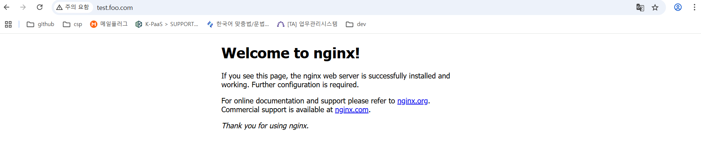
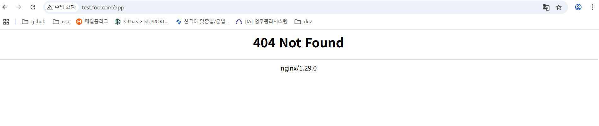

# Service and Networking

[쿠버네티스 Pod 네트워킹](https://coffeewhale.com/k8s/network/2019/04/19/k8s-network-01/) <br/>
[쿠버네티스 Service 네트워킹](https://coffeewhale.com/k8s/network/2019/05/11/k8s-network-02/) <br/>
[쿠버네티스 ingress 네트워킹](https://coffeewhale.com/k8s/network/2019/05/30/k8s-network-03/) <br/>
[Network Policies](https://kubernetes.io/docs/concepts/services-networking/network-policies/) <br/>
[Behavior of to and from selectors](https://kubernetes.io/docs/concepts/services-networking/network-policies/#behavior-of-to-and-from-selectors) <br/>
[서비스 및 파드용 DNS](https://kubernetes.io/ko/docs/concepts/services-networking/dns-pod-service/) <br/>
- [Service and Networking](#service-and-networking)
  - [1. Kubernetes Network 동작 원리](#1-kubernetes-network-동작-원리)
    - [1-1. Pod Network 구조를 이해하고 내용을 간략히 작성](#1-1-pod-network-구조를-이해하고-내용을-간략히-작성)
    - [1-2. Service Network 구조를 이해하고 내용을 간략히 작성](#1-2-service-network-구조를-이해하고-내용을-간략히-작성)
    - [1-3. Ingress Network 구조를 이해하고 내용을 간략히 작성](#1-3-ingress-network-구조를-이해하고-내용을-간략히-작성)
    - [1-4. kube-proxy 역할을 간략히 작성하세요.](#1-4-kube-proxy-역할을-간략히-작성하세요)
  - [2. Service](#2-service)
    - [2-1. 다음 Service Type에 대해 간략히 작성](#2-1-다음-service-type에-대해-간략히-작성)
    - [2-2. 'devops' namespace에서 8080포트로 서비스되는 nginx pod를 만들고 Service를 생성](#2-2-devops-namespace에서-8080포트로-서비스되는-nginx-pod를-만들고-service를-생성)
    - [2-3. Pod를 이용한 Named Service 구성](#2-3-pod를-이용한-named-service-구성)
  - [3. Network Policy](#3-network-policy)
    - [3-1. Network Policy에 대해 간략히 작성](#3-1-network-policy에-대해-간략히-작성)
    - [3-2. 다음 Behavior of to and from selectors 에 대해 간략히 작성](#3-2-다음-behavior-of-to-and-from-selectors-에-대해-간략히-작성)
    - [3-3. 다음 조건에 맞는 NetworkPolicy를 생성하고 접근을 제어](#3-3-다음-조건에-맞는-networkpolicy를-생성하고-접근을-제어)
  - [4. Ingress](#4-ingress)
    - [4-1. Ingress에 대해 간략히 작성](#4-1-ingress에-대해-간략히-작성)
    - [4-2. 다음 조건에 맞는 ingress 를 구성](#4-2-다음-조건에-맞는-ingress-를-구성)
  - [5. DNS](#5-dns)
    - [5-1. 서비스 및 파드용 DNS 에 대해 간략히 작성](#5-1-서비스-및-파드용-dns-에-대해-간략히-작성)
    - [5-2. Service and DNS Lookup 구성](#5-2-service-and-dns-lookup-구성)


## 1. Kubernetes Network 동작 원리
### 1-1. Pod Network 구조를 이해하고 내용을 간략히 작성
- POD 
  - 컨테이너의 그룹 
  - 하나 이상의 컨테이너로 구성될 수 있으며, 같은 네트워크 공간과 스토리지를 공유함
  - Pod 안의 모든 컨테이너는 같은 Network Namespace를 사용(같은 IP와 Port 공간을 공유)
      - ex.) nginx 컨테이너가 localhost:80에서 서버를 열면, 같은 Pod의 scrapyd 컨테이너는 http://localhost:80으로 접근 가능
  - Pod 생성시, 쿠버네티스는 내부적으로 ‘pause’ 컨테이너를 먼저 실행
    - pause 컨테이너가 Pod의 IP와 네트워크 환경을 대표
    - 나머지 컨테이너는 pause 컨테이너의 네트워크를 공유
      - pause 컨테이너 확인 방법
```yaml
#pause 컨테이너의 역할을 알아보기 위해 컨테이너가 2개인 pod 배포
apiVersion: v1
kind: Pod
metadata:
  name: myweb2
spec:
  containers:
  - name: myweb2-nginx
    image: nginx
    ports:
    - containerPort: 80
      protocol: TCP

  - name: myweb2-netshoot
    image: nicolaka/netshoot
    command: ["/bin/bash"]
    args: ["-c", "while true; do sleep 5; curl localhost; done"] # pod가 종료되지 않도록 유지
  terminationGracePeriodSeconds: 0
```
```bash
$ kubectl get pod 
NAME     READY   STATUS    RESTARTS   AGE
myweb2   2/2     Running   0          35m
$ kubectl exec myweb2 -c myweb2-netshoot -- ip addr
$ kubectl exec myweb2 -c myweb2-nginx -- apt update
$ kubectl exec myweb2 -c myweb2-nginx -- apt install -y net-tools

#파드는 하나의 네트워크 네임스페이스를 공유하기때문에 같은 pod내의 모든 컨테이너는 같은 ip주소를 가짐
$ kubectl exec myweb2 -c myweb2-nginx -- ifconfig
eth0: flags=4163<UP,BROADCAST,RUNNING,MULTICAST>  mtu 1500
        inet 198.18.0.65  netmask 255.255.255.255  broadcast 0.0.0.0
        ether 9a:44:d6:01:65:9c  txqueuelen 1000  (Ethernet)
        RX packets 688  bytes 9613596 (9.1 MiB)
        RX errors 0  dropped 0  overruns 0  frame 0
        TX packets 512  bytes 35407 (34.5 KiB)
        TX errors 0  dropped 0 overruns 0  carrier 0  collisions 0

lo: flags=73<UP,LOOPBACK,RUNNING>  mtu 65536
        inet 127.0.0.1  netmask 255.0.0.0
        loop  txqueuelen 1000  (Local Loopback)
        RX packets 5100  bytes 665550 (649.9 KiB)
        RX errors 0  dropped 0  overruns 0  frame 0
        TX packets 5100  bytes 665550 (649.9 KiB)
        TX errors 0  dropped 0 overruns 0  carrier 0  collisions 0

$ kubectl exec myweb2 -c myweb2-netshoot -it -- zsh
~ ifconfig #nginx와 동일한 ip
eth0      Link encap:Ethernet  HWaddr 9A:44:D6:01:65:9C  
          inet addr:198.18.0.65  Bcast:0.0.0.0  Mask:255.255.255.255
          UP BROADCAST RUNNING MULTICAST  MTU:1500  Metric:1
          RX packets:688 errors:0 dropped:0 overruns:0 frame:0
          TX packets:512 errors:0 dropped:0 overruns:0 carrier:0
          collisions:0 txqueuelen:1000 
          RX bytes:9613596 (9.1 MiB)  TX bytes:35407 (34.5 KiB)

lo        Link encap:Local Loopback  
          inet addr:127.0.0.1  Mask:255.0.0.0
          UP LOOPBACK RUNNING  MTU:65536  Metric:1
          RX packets:5184 errors:0 dropped:0 overruns:0 frame:0
          TX packets:5184 errors:0 dropped:0 overruns:0 carrier:0
          collisions:0 txqueuelen:1000 
          RX bytes:676512 (660.6 KiB)  TX bytes:676512 (660.6 KiB)

# nginx 컨테이너가 아닌데, 로컬 접속 되고 tcp 80 listen
~ ss -tnlp
State        Recv-Q       Send-Q              Local Address:Port               Peer Address:Port       Process       
LISTEN       0            511                       0.0.0.0:80                      0.0.0.0:*                        
#localhost 로 접속했지만, 실제로는 같은 pod 내의 다른 컨테이너의 80포트로 접속한 것
~ curl localhost  
<!DOCTYPE html>
<html>
<head>
<title>Welcome to nginx!</title>
<style>
html { color-scheme: light dark; }
body { width: 35em; margin: 0 auto;
font-family: Tahoma, Verdana, Arial, sans-serif; }
</style>
</head>
<body>
<h1>Welcome to nginx!</h1>
<p>If you see this page, the nginx web server is successfully installed and
working. Further configuration is required.</p>

<p>For online documentation and support please refer to
<a href="http://nginx.org/">nginx.org</a>.<br/>
Commercial support is available at
<a href="http://nginx.com/">nginx.com</a>.</p>

<p><em>Thank you for using nginx.</em></p>
</body>
</html>
```


```bash
#netshoot 컨테이너에서 localhost로 curl 요청한 것이 ngignx 로그에 기록 / 같은 네트워크 네임스페이스 공유 확인
$ kubectl logs -f myweb2 -c myweb2-nginx
127.0.0.1 - - [27/Jun/2025:06:48:23 +0000] "GET / HTTP/1.1" 200 615 "-" "curl/8.14.1" "-"
127.0.0.1 - - [27/Jun/2025:06:48:28 +0000] "GET / HTTP/1.1" 200 615 "-" "curl/8.14.1" "-"

#pod 배포 노드 접근 후 crictl로 컨테이너 확인
$ sudo crictl ps | grep myweb2
e0325ba860f56       0ac86781a84f1       49 minutes ago      Running             myweb2-netshoot             0                   b1883d78bf423       myweb2                              default
0caef5cf4b057       9a9a9fd723f1d       49 minutes ago      Running             myweb2-nginx                0                   b1883d78bf423       myweb2                              default
##kubernetes는 pod를 구성할때 pause 컨테이너를 먼저 생성하고 나머지 컨테이너들을 해당 pause컨테이너의 네임스페이스에 연결... 조인...? 한다.


# 워커 노드에서 컨테이너 프로세스 정보 확인
$ ps -ef | grep 'nginx -g' | grep -v grep
root       30552   30496  0 15:09 ?        00:00:00 nginx: master process nginx -g daemon off;
$ ps -ef | grep 'curl' | grep -v grep
root       30608   30496  0 15:09 ?        00:00:00 /bin/bash -c while true; do sleep 5; curl localhost; done

$ NGINXPID=$(ps -ef | grep 'nginx -g' | grep -v grep | awk '{print $2}')
$ NETSHPID=$(ps -ef | grep 'curl' | grep -v grep | awk '{print $2}')
$ echo $NGINXPID
30552
$ echo $NETSHPID
30608

## pause 컨테이너 역할 확인(nginx, netshoot 모두 동일 ns 사용) 30515
$ sudo lsns -p $NGINXPID
        NS TYPE   NPROCS   PID USER  COMMAND
4026531834 time      229     1 root  /sbin/init
4026531837 user      229     1 root  /sbin/init
4026532735 net         8 30515 65535 /pause
4026532834 uts         8 30515 65535 /pause
4026532835 ipc         8 30515 65535 /pause
4026532837 mnt         5 30552 root  nginx: master process nginx -g daemon off;
4026532838 pid         5 30552 root  nginx: master process nginx -g daemon off;
4026532839 cgroup      5 30552 root  nginx: master process nginx -g daemon off;

$ sudo lsns -p $NETSHPID
        NS TYPE   NPROCS   PID USER  COMMAND
4026531834 time      229     1 root  /sbin/init
4026531837 user      229     1 root  /sbin/init
4026532735 net         8 30515 65535 /pause
4026532834 uts         8 30515 65535 /pause
4026532835 ipc         8 30515 65535 /pause
4026532840 mnt         2 30608 root  /bin/bash -c while true; do sleep 5; curl localhost; done
4026532841 pid         2 30608 root  /bin/bash -c while true; do sleep 5; curl localhost; done
4026532842 cgroup      2 30608 root  /bin/bash -c while true; do sleep 5; curl localhost; done


$ sudo crictl inspect e0325ba860f56 | jq
 "namespaces": [
          {
            "type": "pid"
          },
          {
            "path": "/proc/30515/ns/ipc",
            "type": "ipc"
          },
          {
            "path": "/proc/30515/ns/uts",
            "type": "uts"
          },
          {
            "type": "mount"
          },
          {
            "path": "/proc/30515/ns/net",
            "type": "network"
          },
          {
            "type": "cgroup"
          }
...

$ sudo crictl inspect 0caef5cf4b057 | jq
 "namespaces": [
          {
            "type": "pid"
          },
          {
            "path": "/proc/30515/ns/ipc",
            "type": "ipc"
          },
          {
            "path": "/proc/30515/ns/uts",
            "type": "uts"
          },
          {
            "type": "mount"
          },
          {
            "path": "/proc/30515/ns/net",
            "type": "network"
          },
          {
            "type": "cgroup"
          }
        ]
...

## 다른 파드(다른 네트워크 네임스페이스에 위치함)
$ sudo lsns -p 45895
        NS TYPE   NPROCS   PID USER  COMMAND
4026531834 time      240     1 root  /sbin/init
4026531837 user      240     1 root  /sbin/init
4026532857 net         8 45791 65535 /pause
4026532908 uts         8 45791 65535 /pause
4026532909 ipc         8 45791 65535 /pause
4026532914 mnt         2 45895 root  /bin/bash -c while true; do sleep 5; curl localhost; done
4026532915 pid         2 45895 root  /bin/bash -c while true; do sleep 5; curl localhost; done
4026532916 cgroup      2 45895 root  /bin/bash -c while true; do sleep 5; curl localhost; done

```
  - 클러스터 전체에서 고유한 IP를 가짐 → 서로 직접 통신 가능.
  - 일반적인 네트워크와 달리, 컨테이너들은 가상 네트워크 인터페이스(veth), bridge(cbr0), overlay network 등을 통해 연결됨.
    - ex.) Pod A(172.17.1.2) → Pod B(172.17.2.3)로 직접 IP로 통신 가능

- 쿠버네티스 클러스터 네트워크 구조 요약
  - 각 노드에는 **브리지 네트워크(cbr0)**가 있고, 여기서 Pod에 IP를 할당
  - 모든 노드는 서로 통신 가능해야 하며, Pod가 어느 노드에 있든 관계없이 통신 가능해야 함.
    - Pod IP 대역을 노드마다 다르게 설정
    - 라우팅 테이블을 통해 어떤 IP가 어느 노드에 있는지 알아냄
    - 혹은 CNI 플러그인이 자동으로 이걸 처리해줌 (예: Calico)


### 1-2. Service Network 구조를 이해하고 내용을 간략히 작성
- Service
  - Pod가 죽거나 재시작하거나, 혹은 다른 노드로 재배치 --> 서버 pod IP 변경 클라이언트Pod 에서는 알지 못하여 문제가 발생 --> 서비스 앞단에 reverse-proxy(load balancer)를 시킴
  - `proxy를 위치시키기 위해서는 요구되는 요구사항`을 만족하는 `Service`라는 리소스 타입 정의
    - 1) proxy 서버 스스로 내구성이 있으며 장애에 대응할 수 있어야함
    - 2) 트래픽을 전달한 서버 리스트를 가지고 있어야함
    - 3) 서버가 정상적인지 확인할 수 있어야함
  - 각 Pod로 traffic을 포워딩해주는 proxy역할을 함

- Service Network 구조
  - Pod 네트워크처럼 가상 IP주소이지만 동작은 다르게함
  - client pod가 http request를 DNS이름으로 요청하면 client DNS서버가 해당 이름을 service로 매핑
  - http 클라이언트는 DNS로부터 IP를 이용하여 최종적으로 요청을 보내게 됨
    - IP 네트워크는 자신의 host에서 목적지를 찾지 못하면 상위 게이터웨이로 전달하도록 동작함


### 1-3. Ingress Network 구조를 이해하고 내용을 간략히 작성
- ingress : 클러스터 외부에서 클러스터 내부의 서비스로 HTTP 및 HTTPS 트래픽을 라우팅하는 역할을 함

- 왼쪽 그림처럼 기존의 NodePort 또는 LoadBalancer타입의 service는 deployement 3개를 외부에 노출해야한다면 service가 3개 필요
-  Ingress를 사용하면 3개의 service에 각각 URL이 존재하지 않고 Ingress에 접근하기위한 단 하나의 URL만 존재

```yaml
apiVersion: networking.k8s.io/v1
kind: Ingress
metadata:
  name: my-ingress
  annotations:
    nginx.ingress.kubernetes.io/rewrite-target: /
spec:
  rules:
  - host: example.com
    http:
      paths:
      - path: /
        pathType: Prefix
        backend:
          service:
            name: my-service
            port:
              number: 80
```
클라이언트 → LoadBalancer 또는 NodePort → Ingress Controller → Ingress Resource → Backend Service → Pod 순으로 트래픽을 전달

### 1-4. kube-proxy 역할을 간략히 작성하세요.
`kube-proxy` :  쿠버네티스에서 서비스를 만들었을 떄 클러스터 IP나 노드 포트로 접근할 수 있게 만들어 실제 조작을 하는 컴포넌트
- Service를 통해 동작하는 네트워크에 대한 처리를 담당하는, 단어 그대로 proxy 역할을 관장하는 애플리케이션
  - 1) 쿠버네티스 컨트롤 플레인의 서비스 및 엔드포인트 오브젝트의 추가와 제거를 감시
  - 2) 요청이 Service로 들어왔을 때 네트워크 처리를 담당
    - kube-proxy 모드
      - user space모드 : 요청 시, iptables를 거쳐 kube-proxy가 직접 프록시 서버를 프로세스로 실행하여 로드 밸런싱을 수행하는 방식(현재 권장X)
      - iptables모드 : 요청 시, 리눅스 iptables를 이용하여 서비스로 오는 패킷과 나가는 패킷을 제어하는 방식 (default)
      - IPVS 모드 : 요청 시, 리눅스 IPVS를 이용하여 서비스로 오는 패킷과 나가는 패킷을 제어하는 방식(iptables 모드와 유사하지만 IPVS라는 리눅스 커널 기능)

## 2. Service
### 2-1. 다음 Service Type에 대해 간략히 작성
> ClusterIP, NodePort, LoadBalancer 
<br>
1. ClusterIP<br>
- k8s Cloudter 내부에서 사용하는 Service Type<br>
- Cluster IP > Pod IP:TargetPort로 트래픽을 전달한다. 하지만 이는 오직 Cluster 내부에서는 접근 가능한 Private IP<br>

```yaml
apiVersion: v1
kind: Service
metadata:
  name: myapp-service
spec:
  type: ClusterIP
  ports:
  - name: http
    protocol: TCP
    targetPort: 9376
    port: 80
  - name: https
    protocol: TCP
    targetPort: 9377
    port: 443
  selector:
    app: myapp
    type: frontend
```
2. NodePort
- 외부에서 Node IP에 대한 접속 Port를 지정하는 것
- Node IP:NodePort로 요청이 들어올 경우 Pod IP:TargetPort로 트래픽을 전달

```yaml
apiVersion: v1
kind: Service
metadata:
  name: myapp-service
spec:
  type: NodePort
  ports:
  - targetPort: 80		# 애플리케이션(파드)을 노출하는 포트
    port: 80			# 서비스를 노출하는 포트
    nodePort: 30008		# 외부 사용자가 애플리케이션에 접근하기 위한 포트번호(선택)
  selector:				# 이 서비스가 적용될 파드 정보를 지정
    app: myapp
    type: frontend
```

3. LoadBalancer
- 외부 LoadBalancer를 제공하는 클라우드 환경을 고려하여, 해당 Loadbalancer를 Service로 프로비저닝할 수 있는 Type
```yaml
apiVersion: v1
kind: Service
metadata:
  name: myapp-service
spec:
  type: LoadBalancer
  ports:
    - name : http
      targetPort: 80    # 애플리케이션(파드)을 노출하는 포트
      port: 80      # 서비스를 노출하는 포트
      nodePort: 30008   # 외부 사용자가 애플리케이션에 접근하기 위>한 포트번호(선택)
  selector:       # 이 서비스가 적용될 파드 정보를 지정
    app: myapp
    type: frontend
```
### 2-2. 'devops' namespace에서 8080포트로 서비스되는 nginx pod를 만들고 Service를 생성
> namespace: devops <br>
> service name: internal-svc <br>
> type: ClusterIP <br>
> port: 8080 <br>

```bash
$ kubectl create namespace devops
$ kubectl run nginx --image=nginx --port=8080 -n devops --dry-run=client -o yaml > nginx-yang.yaml
$ vi nginx-yang.yaml
apiVersion: v1
kind: Pod
metadata:
  creationTimestamp: null
  labels:
    run: nginx
  name: nginx
  namespace: devops
spec:
  containers:
  - image: nginx
    name: nginx
    ports:
    - containerPort: 8080
    resources: {}
  dnsPolicy: ClusterFirst
  restartPolicy: Always
status: {}

$ kubectl apply -f nginx-yang.yaml 
pod/nginx created

$ kubectl expose pod nginx --port=8080 --target-port=8080 --name=internal-svc --type=ClusterIP -n devops --dry-run=client -o yaml > nginx-svc.yaml
service/internal-svc exposed

$ kubectl get all -n devops
NAME        READY   STATUS    RESTARTS   AGE
pod/nginx   1/1     Running   0          81s

NAME                   TYPE        CLUSTER-IP       EXTERNAL-IP   PORT(S)    AGE
service/internal-svc   ClusterIP   198.19.216.205   <none>        8080/TCP   12s

```
### 2-3. Pod를 이용한 Named Service 구성
> 미리 배포한 'nginx pod'에 기존의 nginx 컨테이너의 포트 '8080/tcp'를 expose하는 'http'라는 이름을 추가하세요. <br>
> 컨테이너 포트 http를 expose하는 'front-end-svc'라는 30080포트로 운영되는 새 service를 만들고, 준비된 node의 'NodePort'를 통해 개별 Pods를 expose되도록 Service를 구성하세요. <br>
> targetPort 는 숫자가 아닌 문자로 작성해야합니다.

```bash
$ vi nginx-yang.yaml
apiVersion: v1
kind: Pod
metadata:
  creationTimestamp: null
  labels:
    run: nginx
  name: nginx
  namespace: devops
spec:
  containers:
  - image: nginx
    name: nginx
    ports:
    - containerPort: 8080
      name: http # 추가
    resources: {}
  dnsPolicy: ClusterFirst
  restartPolicy: Always
status: {}

$ kubectl apply -f nginx-yang.yaml 
pod/nginx created

$ kubectl expose pod nginx --name=front-end-svc --port=30080 --target-port=http --type=NodePort -n devops --dry-run=client -o yaml > nginx-name-svc.yaml
$ kubectl apply -f nginx-name-svc.yaml
service/front-end-svc exposed

```

## 3. Network Policy
### 3-1. Network Policy에 대해 간략히 작성
쿠버네티스에서 각 파드는 기본적으로 서로간에 모든 통신이 가능한 상태<br>
때문에 DB처럼 보안적으로 중요한 파드에 대해 접근을 제어하기 위하여 **NetworkPolicy** 서비스 활용<br>
파드 생성 시 labels에 명시한 key : value를 기준으로 NetworkPolicy 적용<br>


### 3-2. 다음 Behavior of to and from selectors 에 대해 간략히 작성
> podSelector, namespaceSelector, ipBlock<br>

`podSelector` : 네트워크폴리시를 통해서, 인그레스 소스 또는 이그레스 목적지로 허용되야 하는 동일한 네임스페이스에 있는 특정 파드들을 선택<br>
`namespaceSelector` : 모든 파드가 인그레스 소스 또는 이그레스를 대상으로 허용되어야 하는 특정 네임스페이스를 선택<br>
`namespaceSelector 와 podSelector` : namespaceSelector 와 podSelector 를 모두 지정하는 단일 to/from 항목은 특정 네임스페이스 내에서 특정 파드를 선택<br>
`ipBlock` :  인그레스 소스 또는 이그레스 대상으로 허용할 IP CIDR 범위를 선택한다. 파드 IP는 임시적이고 예측할 수 없기에 클러스터 외부 IP여야함


### 3-3. 다음 조건에 맞는 NetworkPolicy를 생성하고 접근을 제어
> POD 생성 (namespace: default, name: poc, image: nginx, port: 80, label: app=poc)<br>
> "partition=customera"를 사용하는 namespace에서만 poc의 80포트로 연결할 수 있도록 default namespace에 'allow-webfrom-customera'라는 network Policy를 설정하세요.<br>
> 보안 정책상 다른 namespace의 접근은 제한합니다.<br>
```bash
$ kubectl run poc --image=nginx --port=80 -l app=poc -n default --dry-run=client -o yaml > networkpolicy-custom.yaml
$ kubectl apply -f networkpolicy-custom.yaml 
pod/poc created

$ kubectl expose pod poc --port=80 --target-port=80 --name=poc --type=ClusterIP --namespace=default
service/poc exposed

$ vi allow-webfrom-customera.yaml
apiVersion: networking.k8s.io/v1
kind: NetworkPolicy
metadata:
  name: allow-webfrom-customera
  namespace: default
spec:
  podSelector:
    matchLabels:
      app: poc
  policyTypes:
  - Ingress
  ingress:
  - from:
    - namespaceSelector:
        matchLabels:
          partition: customera
    ports:
    - protocol: TCP
      port: 80


$ kubectl apply -f allow-webfrom-customera.yaml
networkpolicy.networking.k8s.io/allow-webfrom-customera created

$ kubectl create ns customera
namespace/customera created

$ kubectl label namespace customera partition=customera
namespace/customera labeled


#테스트용 파드 생성
$ kubectl run test-allowed -n customera --image=curlimages/curl --restart=Never --command -- sleep 3600
pod/test-allowed created

#정상 접근 확인
$ kubectl exec -it -n customera test-allowed -- curl -s http://poc.default.svc.cluster.local
<!DOCTYPE html>
<html>
<head>
<title>Welcome to nginx!</title>
<style>
html { color-scheme: light dark; }
body { width: 35em; margin: 0 auto;
font-family: Tahoma, Verdana, Arial, sans-serif; }
</style>
</head>
<body>
<h1>Welcome to nginx!</h1>
<p>If you see this page, the nginx web server is successfully installed and
working. Further configuration is required.</p>

<p>For online documentation and support please refer to
<a href="http://nginx.org/">nginx.org</a>.<br/>
Commercial support is available at
<a href="http://nginx.com/">nginx.com</a>.</p>

<p><em>Thank you for using nginx.</em></p>
</body>
</html>

$ kubectl create ns testns
namespace/testns created

#테스트용 파드 생성
$ kubectl run test-denied -n testns  --image=curlimages/curl --restart=Never --command -- sleep 3600
pod/test-denied created

#testns 네임스페이스는 라벨이 없기떄문에 접근 불가
$ kubectl exec -it -n testns test-denied -- curl -s http://poc.default.svc.cluster.local
command terminated with exit code 130..
```


## 4. Ingress
### 4-1. Ingress에 대해 간략히 작성
- ingress : 클러스터 외부에서 클러스터 내부의 서비스로 HTTP 및 HTTPS 트래픽을 라우팅하는 역할을 함
  - 외부 요청의 라우팅 : 특정 경로로 들어오는 요청을 어떤 service로 전달할지에 대한 결정
  - 가상 호스트 요청 처리 : 같은 ip에 대해 다른 도메인 이름으로 요청이 도착했을때 어떻게 처리할지를 정의
  - ssl/tls 보안 연결 처리 : 여러개의 서비스로 요청을 라우팅할 때, 보안 연결을 위한 인증서 적용
  - 로드 밸런싱을 통한 트래픽 분산

### 4-2. 다음 조건에 맞는 ingress 를 구성
> POD 생성1 (namespace: ingress, name: ingress-nginx, image: nginx, port: 80)<br>
> POD 생성2 (namespace: ingress, name: app-nginx, image: nginx, port: 80)<br>
> "test.foo.com" 접속했을 때 ingress-nginx 서비스로 연결<br>
> "test.foo.com/app" 접속했을 때 app-nginx 서비스로 연결<br>

```bash
$ kubectl run ingress-nginx --image=nginx --port=80
pod/ingress-nginx created

$ kubectl expose pod ingress-nginx --name=ingress-nginx-svc --port=80 --type=ClusterIP
service/ingress-nginx-svc exposed

$ kubectl run app-nginx --image=nginx --port=80
pod/app-nginx created

$ kubectl expose pod app-nginx --name=app-nginx-svc --port=80 --type=ClusterIP
service/app-nginx-svc exposed

$ kubectl get all
NAME                                                                  READY   STATUS    RESTARTS   AGE
pod/app-nginx                                                         1/1     Running   0          71s
pod/ingress-nginx                                                     1/1     Running   0          89s
pod/my-ingress-controller-ingress-nginx-controller-76f69d679d-wjxxz   1/1     Running   0          19m

NAME                                                               TYPE           CLUSTER-IP       EXTERNAL-IP                                                                    PORT(S) 
service/app-nginx-svc                                              ClusterIP      198.19.133.6     <none>                                                                         80/TCP  
service/ingress-nginx-svc                                          ClusterIP      198.19.198.226   <none>                                                                         80/TCP 


$ vi ingress-nginx.yaml
apiVersion: networking.k8s.io/v1
kind: Ingress
metadata:
 name: ingress-nginx
spec:
  ingressClassName: "nginx"
  rules:
  - host: "test.foo.com"
    http:
      paths:
      - path: /
        pathType: Prefix
        backend:
          service:
            name: ingress-nginx-svc
            port:
              number: 80
      - path: /app
        pathType: Prefix
        backend:
          service:
            name: app-nginx-svc
            port:
              number: 80


$ kubectl apply -f ingress.yaml 
ingress.networking.k8s.io/ingress-nginx created
```

- etc/hosts 추가 (ingress controller ip)
```bash
27.96.148.226 test.foo.com
```

- 접속 확인
> http://test.foo.com/


>http://test.foo.com/app



## 5. DNS
### 5-1. 서비스 및 파드용 DNS 에 대해 간략히 작성
파드와 서비스를 위한 DNS 레코드를 생성한다. 사용자는 IP 주소 대신에 일관된 DNS 네임을 통해서 서비스에 접속할 수 있음

쿠버네티스는 DNS를 설정 하기 위해 사용되는 파드와 서비스에 대한 정보를 발행

Kubelet은 실행 중인 컨테이너가 IP가 아닌 이름으로 서비스를 검색할 수 있도록 파드의 DNS를 설정<br>
기본적으로 클라이언트 파드의 DNS 검색 리스트는 파드 자체의 네임스페이스와 클러스터의 기본 도메인을 포함


>쿠버네티스 클러스터 내 POD에서 어떤 도메인을 찾고자 할 때 kube-system 네임스페이스에 실행되고 있는 CoreDNS가 네임서버로 사용된다. <br>
```bash
$ kubectl get po -n kube-system -l k8s-app=kube-dns
NAME                       READY   STATUS    RESTARTS   AGE
coredns-69c4df9f67-jkwvd   1/1     Running   0          265d
coredns-69c4df9f67-t5cb2   1/1     Running   0          265d
```
- Cluster 내부에서 Pod가 DNS 질의를 할때 동작


1. 파드에서 DNS Query를 수행하면 먼저 파드 내부에 Local DNS Resolver로 전달한다. 여기서 resolv.conf에 구성된 파일을 확인하고 DNS 조회를 수행
2. NodeLocalDNS는 DNS 요청 결과를 기록해 두는 캐시 역할을 수행하며 빠르게 DNS Query를 처리 도움을 줌
3. 만약 캐싱된 정보에 대상이 없을 경우 CoreDNS로 전달
4. CoreDNS는 Kubernetes 클러스터 내부의 서비스와 리소스에 대한 DNS 조회를 처리 (서비스 조회, 외부 DNS 조회, 캐싱)
5. CoreDNS 구성은 corefile에 의해 관리되며 필요에 따라 커스터마이징 가능 (kubectl describe cm -n kube-system coredns 명령어를 통해 확인 가능)

### 5-2. Service and DNS Lookup 구성
> image nginx를 사용하는 resolver pod를 생성하고 resolver-service라는 service를 구성합니다.<br>
> 클러스터 내에서 service와 pod 이름을 조회할 수 있는지 테스트합니다.<br>
> • dns 조회에 사용하는 pod 이미지는 busybox:1.28이고, service와 pod 이름 조회는 nlsookup을 사용합니다.<br>
> • service 조회 결과와 pod name 조회 결과를 추출하세요.<br>

```bash
$ kubectl run resolver --image=nginx --port=80
pod/resolver created

$ kubectl expose pod resolver --port=80 --name=resolver-service
service/resolver-service exposed

$ kubectl run dns-client --image=busybox:1.28 --restart=Never --command -- sleep 3600
pod/dns-client created

$ kubectl exec -it dns-client -- /bin/sh
/ # nslookup resolver-service
Server:    169.254.25.10
Address 1: 169.254.25.10

Name:      resolver-service
Address 1: 198.19.192.170 resolver-service.default.svc.cluster.local
/ # nslookup resolver
Server:    169.254.25.10
Address 1: 169.254.25.10

nslookup: can't resolve 'resolver'
```