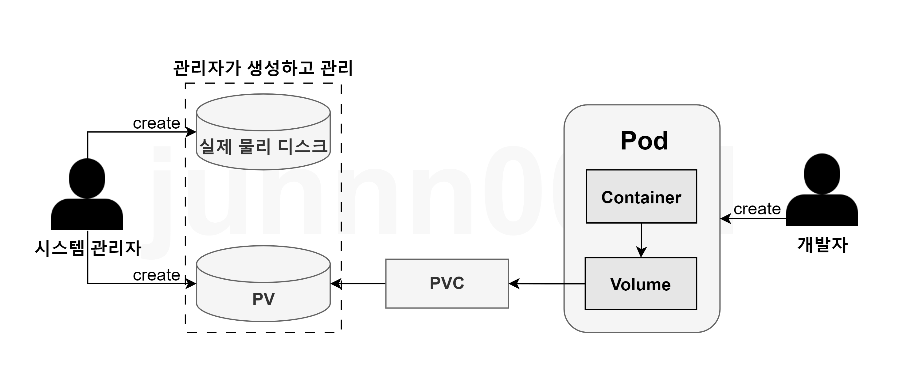

# Storage

[Storage](https://kubernetes.io/ko/docs/concepts/storage/) <br/>

- [Storage](#storage)
  - [1. Kubernetes Storage](#1-kubernetes-storage)
    - [1-1. Kubernetes Storage 구조를 이해하고 내용을 간략히 작성](#1-1-kubernetes-storage-구조를-이해하고-내용을-간략히-작성)
  - [2. emptyDir](#2-emptydir)
    - [2-1. emptyDir Volume에 대해 간략히 작성](#2-1-emptydir-volume에-대해-간략히-작성)
    - [2-2. emptyDir Volume을 공유하는 multi-pod 구성](#2-2-emptydir-volume을-공유하는-multi-pod-구성)
  - [3. HostPath](#3-hostpath)
    - [3-1. HostPath Volume에 대해 간략히 작성](#3-1-hostpath-volume에-대해-간략히-작성)
    - [3-2. HostPath Volume 구성](#3-2-hostpath-volume-구성)
  - [4. PV(Persistent Volume) \& PVC(Persistent Volume Claim)](#4-pvpersistent-volume--pvcpersistent-volume-claim)
    - [4-1. PV에 대해 간략히 작성](#4-1-pv에-대해-간략히-작성)
    - [4-2. PVC에 대해 간략히 작성](#4-2-pvc에-대해-간략히-작성)
    - [4-3. 다음 조건에 맞는 PersistentVolume 을 생성](#4-3-다음-조건에-맞는-persistentvolume-을-생성)
    - [4-4. PVC를 사용하는 애플리케이션 Pod 구성](#4-4-pvc를-사용하는-애플리케이션-pod-구성)


## 1. Kubernetes Storage
### 1-1. Kubernetes Storage 구조를 이해하고 내용을 간략히 작성
- Pod는 내부에서 컨테이너 들이 실행되며, 서로 CPU, RAM, Network Interface 등 리소스를 공유하게 됨
- 파일 시스템의 경우는 다른 리소스와 다르게, Pod 내부의 각 컨테이너는 각각의 분리된 파일 시스템을 가짐
- 컨테이너 마다의 파일 시스템은 컨테이너 이미지에서 제공하기 때문
- Docker Volume과 동일하게, 쿠버네티스의 컨테이너 내 디스크에 있는 파일은 임시적
- 이미지 레이어으로 부터 Copy-On-Write 전략을 통한 컨테이너 레이어를 생성하기 때문
    - Pod 생명 주기 == Contianer Layer의 파일 생명 주기
- 컨테이너 레이어의 데이터는 수정할 수는 있지만 영구적으로 저장되지 않음
- 이로 인해 파일이 손실되거나, 여러 컨테이너 간 파일 공유 불가능하다는 문제점이 있음
- 쿠버네티스의 볼륨은 Pod의 구성요소로 컨테이너와 동일하게 Pod spec에서 정의됨
- 볼륨은 Pod의 모든 컨테이너에서 사용 가능하지만 접근하려는 컨테이너에서 각각 마운트 되어야 함
- 각 컨테이너의 어떤 경로에나 볼륨을 마운트할 수 있음

## 2. emptyDir
### 2-1. emptyDir Volume에 대해 간략히 작성
- pod 사이에 데이터를 공유하는 일시적인 스토리지를 제공 (파드가 삭제되면 데이터가 손실됨)
- 간단한  캐싱 용도로서 사용
- 데이터 보존이 필요하지 않을 떄 유용함

### 2-2. emptyDir Volume을 공유하는 multi-pod 구성
> 다음 조건에 맞춰서 nginx 웹서버 pod가 생성한 로그파일을 받아서 STDOUT으로 출력하는 busybox 컨테이너를 구성<br>
> (하나의 deployment에 2개의 container로 구성.)<br><br>
> deployment Name: weblog<br>
> Web container:<br>
> • Image: nginx:1.17<br>
> • Volume mount : /var/log/nginx<br>
> • readwrite<br><br>
> Log container:<br>
> • Image: busybox<br>
> • Command: /bin/sh, -c, "tail -n+1 -f /data/access.log"<br>
> • Volume mount : /data<br>
> • readonly<br>
> emptyDir 볼륨을 통한 데이터 공유가 이루어져야함<br>


```bash
$ kubectl create deployment weblog --image=nginx:1.17 --dry-run=client -o yaml > weblog.yaml
$ vi weblog.yaml 
apiVersion: v1
kind: Pod
metadata:
  creationTimestamp: null
  labels:
    run: weblog
  name: weblog
  namespace: yang
spec:
  containers:
  - image: nginx:1.17
    name: weblog
    volumeMounts:
    - mountPath: /var/log/nginx
      name: weblog
  - image: busybox
    name: log
    args: [/bin/sh, -c, 'tail -n+1 -f /data/access.log']
    volumeMounts:
    - mountPath: /data
      name: weblog
      readOnly: true
  volumes:
  - name: weblog
    emptyDir: {}

$ kubectl apply -f weblog.yaml 
pod/weblog created

$ kubectl get pod -n yang
NAME     READY   STATUS    RESTARTS   AGE
weblog   2/2     Running   0          18s

$ kubectl exec -n yang -c weblog pod/weblog -- /bin/sh -c "echo 'log-test-entry' >> /var/log/nginx/access.log"

$ kubectl logs -n yang pod/weblog -c log
log-test-entry #정상 동작 확인

```

## 3. HostPath
### 3-1. HostPath Volume에 대해 간략히 작성
- 파드가 실행된 호스트이 파일이나 디렉터리를 파드에 마운트
- emptyDir과의 차이: path를 파드들이 공유하기 때문에 파드가 죽어도 노드의 볼륨은 안 죽음
- 파드가 재시작되어서 새로운 노드에서 시작할 경우, 새로운 노드의 hostpath를 사용함(이전 노드에서 사용한 hostpath 접근 불가)

### 3-2. HostPath Volume 구성
>fluentd.yaml 파일에 다음 조건에 맞게 볼륨 마운트를 설정<br>
>Worker node의 도커 컨테이너 디렉토리를 동일 디렉토리로 pod에 마운트<br>
>Worker node의 /var/log 디렉토리를 fluentd Pod에 동일이름의 디렉토리 마운트<br>
```bash
$ sudo mkdir -p /var/lib/docker
$ vi fluentd.yaml
apiVersion: v1
kind: Pod
metadata:
  name: fluentd
  namespace: yang
spec:
  nodeName: qna-cluster-001
  containers:
  - name: fluentd
    image: fluent/fluentd
    volumeMounts:
    - name: docker-logs
      mountPath: /var/lib/docker
    - name: host-logs
      mountPath: /var/log
  volumes:
  - name: docker-logs
    hostPath:
      path: /var/lib/docker
      type: Directory
  - name: host-logs
    hostPath:
      path: /var/log
      type: Directory


$ kubectl get pod -n yang
NAME             READY   STATUS    RESTARTS   AGE
fluentd          1/1     Running   0          21s

$ kubectl exec -it fluentd -n yang -- ls /var/lib | grep docker
apt  docker  dpkg  misc  pam  shells.state  systemd
```


## 4. PV(Persistent Volume) & PVC(Persistent Volume Claim)
> 참고 이미지

### 4-1. PV에 대해 간략히 작성
- 클러스터 내의 지속적인 스토리지
- 클러스터 수준에서 관리됨, 네임스페이스와 무관하게 설정
- 수동 생성, 클러스터 관리자에 의해 자동으로 생성 가능
- 파드에서 pv를 사용하려면 pvc를 통해 바인딩해야 함(PV에 바로 연결하지 않고 PVC를 통하여 연결됨)
  - 파드를 PV에 바로 연결하지 않는 이유는 쿠버네티스가 User와 Admin으로 영역을 나눠서 관리하기 때문
### 4-2. PVC에 대해 간략히 작성
- 애플리케이션이 pv를 요청하고 바인딩하기 위한 객체
- 동적 프로비저닝을 요청할 수 있음
    * 동적 프로비저닝: StorageClass와 프로비저너를 사용하여 자동으로 PV를 생성해서 PVC와 Bound 시키는 기능.. pv를 직접 만들 필요가 없음
- pvc는 네임스페이스 내에서 사용되고 pv와 연결됨
- 파드나 애플리케이션은 PVC를 사용하여 지속적인 스토리지를 요청하고 PV와 바인딩 가능
- PVC는 여러 파드에서 공유 및 단독 사용 가능
  
### 4-3. 다음 조건에 맞는 PersistentVolume 을 생성
> pv001라는 이름으로 size 1Gi, access mode ReadWriteMany를 사용하여 persistent volume을 생성<br>
> volume type은 hostPath이고 위치는 /tmp/app-config<br>
```bash
$ vi pv001.yaml
apiVersion: v1
kind: PersistentVolume
metadata:
  name: pv001-yang
spec:
  capacity:
    storage: 1Gi
  accessModes:
  - ReadWriteMany
  hostPath:
    path: /tmp/app-config

$ kubectl apply -f pv001.yaml 
persistentvolume/pv001-yang created

$ kubectl get pv
NAME         CAPACITY   ACCESS MODES   RECLAIM POLICY   STATUS      CLAIM   STORAGECLASS   VOLUMEATTRIBUTESCLASS   REASON   AGE
pv001-yang   1Gi        RWX            Retain           Available                          <unset>                          20s

$ kubectl describe pv pv001-yang 
Name:            pv001-yang
Labels:          <none>
Annotations:     <none>
Finalizers:      [kubernetes.io/pv-protection]
StorageClass:    
Status:          Available
Claim:           
Reclaim Policy:  Retain
Access Modes:    RWX
VolumeMode:      Filesystem
Capacity:        1Gi
Node Affinity:   <none>
Message:         
Source:
    Type:          HostPath (bare host directory volume)
    Path:          /tmp/app-config
    HostPathType:  
Events:            <none>

```

### 4-4. PVC를 사용하는 애플리케이션 Pod 구성
> 다음의 조건에 맞는 새로운 PersistentVolumeClaim 생성<br>
> • Name: pvc-yang<br>
> • Class: cp-storageclass<br>
> • Capacity: 10Mi<br><br>
> 생성한 pvc-yang PersistentVolumeClaim을 mount하는 Pod 를 생성<br>
> • Name: web-server-pod<br>
> • Image: nginx<br>
> • Mount path: /usr/share/nginx/html<br><br>
> Volume에서 ReadWriteMany 액세스 권한을 가지도록 구성<br>

```bash
$ vi pvc.yaml
apiVersion: v1
kind: PersistentVolumeClaim
metadata:
  name: pvc-yang
  namespace: yang
spec:
  accessModes:
  - ReadWriteMany
  resources:
    requests:
      storage: 10Mi
  storageClassName: cp-storageclass

$ kubectl apply -f pvc.yaml 
persistentvolumeclaim/pvc-yang created

$ kubectl get pvc -n yang
NAME       STATUS   VOLUME                                     CAPACITY   ACCESS MODES   STORAGECLASS      VOLUMEATTRIBUTESCLASS   AGE
pvc-yang   Bound    pvc-e6d36418-497e-492f-9fde-67328981f16a   10Mi       RWX            cp-storageclass   <unset>                 4s

$ vi pvc-pod.yaml
apiVersion: v1
kind: Pod
metadata:
  name: web-server-pod
  namespace: yang
spec:
  containers:
  - name: nginx
    image: nginx
    volumeMounts:
    - mountPath: /usr/share/nginx/html
      name: html-volume
  volumes:
  - name: html-volume
    persistentVolumeClaim:
      claimName: pvc-yang

$ kubectl apply -f pvc-pod.yaml 
pod/web-server-pod created

$ kubectl describe pod web-server-pod -n yang
Name:             web-server-pod
Namespace:        yang
Priority:         0
Service Account:  default
Node:             qna-cluster-004/172.16.1.15
Start Time:       Mon, 07 Jul 2025 14:00:42 +0900
Labels:           <none>
Annotations:      cni.projectcalico.org/containerID: deeee773ef87e3f7e3d5b0224793771fc6921b2359fb3d6d820defa00540165f
                  cni.projectcalico.org/podIP: 10.233.90.159/32
                  cni.projectcalico.org/podIPs: 10.233.90.159/32
Status:           Running
IP:               10.233.90.159
IPs:
  IP:  10.233.90.159
Containers:
  nginx:
    Container ID:   cri-o://5cbb4f88985f233656869fce8e4245d87df03debe9dc24ac0a58f0522d90a53e
    Image:          nginx
    Image ID:       docker.io/library/nginx@sha256:13920fe73b382aa9017f7cf38b1377bc46ffb605fe980eb00f61aad26311ebf7
    Port:           <none>
    Host Port:      <none>
    State:          Running
      Started:      Mon, 07 Jul 2025 14:00:45 +0900
    Ready:          True
    Restart Count:  0
    Environment:    <none>
    Mounts:
      /usr/share/nginx/html from html-volume (rw)
      /var/run/secrets/kubernetes.io/serviceaccount from kube-api-access-264j4 (ro)
Conditions:
  Type                        Status
  PodReadyToStartContainers   True 
  Initialized                 True 
  Ready                       True 
  ContainersReady             True 
  PodScheduled                True 
Volumes:
  html-volume:
    Type:       PersistentVolumeClaim (a reference to a PersistentVolumeClaim in the same namespace)
    ClaimName:  pvc-yang
    ReadOnly:   false
  kube-api-access-264j4:
    Type:                    Projected (a volume that contains injected data from multiple sources)
    TokenExpirationSeconds:  3607
    ConfigMapName:           kube-root-ca.crt
    ConfigMapOptional:       <nil>
    DownwardAPI:             true
QoS Class:                   BestEffort
Node-Selectors:              <none>
Tolerations:                 node.kubernetes.io/not-ready:NoExecute op=Exists for 300s
                             node.kubernetes.io/unreachable:NoExecute op=Exists for 300s
Events:
  Type    Reason     Age   From               Message
  ----    ------     ----  ----               -------
  Normal  Scheduled  36s   default-scheduler  Successfully assigned yang/web-server-pod to qna-cluster-004
  Normal  Pulling    35s   kubelet            Pulling image "nginx"
  Normal  Pulled     33s   kubelet            Successfully pulled image "nginx" in 2.386s (2.386s including waiting). Image size: 196385142 bytes.
  Normal  Created    33s   kubelet            Created container nginx
  Normal  Started    33s   kubelet            Started container nginx
```