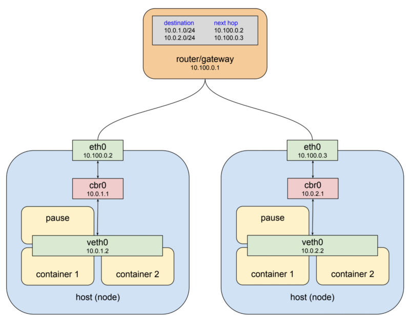

# Service and Networking

[쿠버네티스 Pod 네트워킹](https://coffeewhale.com/k8s/network/2019/04/19/k8s-network-01/) <br/>
[쿠버네티스 Service 네트워킹](https://coffeewhale.com/k8s/network/2019/05/11/k8s-network-02/) <br/>

- [Service and Networking](#service-and-networking)
  - [1. Kubernetes Network 동작 원리](#1-kubernetes-network-동작-원리)
    - [1-1. Pod Network 구조를 이해하고 내용을 간략히 작성](#1-1-pod-network-구조를-이해하고-내용을-간략히-작성)
    - [1-2. Service Network 구조를 이해하고 내용을 간략히 작성](#1-2-service-network-구조를-이해하고-내용을-간략히-작성)
    - [1-3. Ingress Network 구조를 이해하고 내용을 간략히 작성](#1-3-ingress-network-구조를-이해하고-내용을-간략히-작성)
    - [1-4. kube-proxy 역할을 간략히 작성하세요.](#1-4-kube-proxy-역할을-간략히-작성하세요)
  - [2. Service](#2-service)
    - [2-1. 다음 Service Type에 대해 간략히 작성](#2-1-다음-service-type에-대해-간략히-작성)
    - [2-2. 'devops' namespace에서 8080포트로 서비스되는 nginx pod를 만들고 Service를 생성](#2-2-devops-namespace에서-8080포트로-서비스되는-nginx-pod를-만들고-service를-생성)
    - [2-3. Pod를 이용한 Named Service 구성](#2-3-pod를-이용한-named-service-구성)
  - [3. Network Policy](#3-network-policy)
    - [3-1. Network Policy에 대해 간략히 작성](#3-1-network-policy에-대해-간략히-작성)
    - [3-2. 다음 Behavior of to and from selectors 에 대해 간략히 작성](#3-2-다음-behavior-of-to-and-from-selectors-에-대해-간략히-작성)
    - [3-3. 다음 조건에 맞는 NetworkPolicy를 생성하고 접근을 제어](#3-3-다음-조건에-맞는-networkpolicy를-생성하고-접근을-제어)
  - [4. Ingress](#4-ingress)
    - [4-1. Ingress에 대해 간략히 작성](#4-1-ingress에-대해-간략히-작성)
    - [4-2. 다음 조건에 맞는 ingress 를 구성](#4-2-다음-조건에-맞는-ingress-를-구성)
  - [5. DNS](#5-dns)
    - [5-1. 서비스 및 파드용 DNS 에 대해 간략히 작성](#5-1-서비스-및-파드용-dns-에-대해-간략히-작성)
    - [5-2. Service and DNS Lookup 구성](#5-2-service-and-dns-lookup-구성)


## 1. Kubernetes Network 동작 원리
### 1-1. Pod Network 구조를 이해하고 내용을 간략히 작성
- POD 
  - 컨테이너의 그룹 
  - 하나 이상의 컨테이너로 구성될 수 있으며, 같은 네트워크 공간과 스토리지를 공유함
  - Pod 안의 모든 컨테이너는 같은 Network Namespace를 사용(같은 IP와 Port 공간을 공유)
      - ex.) nginx 컨테이너가 localhost:80에서 서버를 열면, 같은 Pod의 scrapyd 컨테이너는 http://localhost:80으로 접근 가능
  - Pod 생성시, 쿠버네티스는 내부적으로 ‘pause’ 컨테이너를 먼저 실행
    - pause 컨테이너가 Pod의 IP와 네트워크 환경을 대표
    - 나머지 컨테이너는 pause 컨테이너의 네트워크를 공유
      - pause 컨테이너 확인 방법
```yaml
#컨테이너가 2개인 pod 배포
apiVersion: v1
kind: Pod
metadata:
  name: myweb2
spec:
  containers:
  - name: myweb2-nginx
    image: nginx
    ports:
    - containerPort: 80
      protocol: TCP

  - name: myweb2-netshoot
    image: nicolaka/netshoot
    command: ["/bin/bash"]
    args: ["-c", "while true; do sleep 5; curl localhost; done"] # 포드가 종료되지 않도록 유지합니다

  terminationGracePeriodSeconds: 0
```
```bash
$ kubectl get pod 
NAME     READY   STATUS    RESTARTS   AGE
myweb2   2/2     Running   0          35m
$ kubectl exec myweb2 -c myweb2-netshoot -- ip addr
$ kubectl exec myweb2 -c myweb2-nginx -- apt update
$ kubectl exec myweb2 -c myweb2-nginx -- apt install -y net-tools

#파드는 하나의 네트워크 네임스페이스를 공유하기때문에 같은 pod내의 모든 컨테이너는 같은 ip주소를 가짐
$ kubectl exec myweb2 -c myweb2-nginx -- ifconfig
eth0: flags=4163<UP,BROADCAST,RUNNING,MULTICAST>  mtu 1500
        inet 198.18.0.65  netmask 255.255.255.255  broadcast 0.0.0.0
        ether 9a:44:d6:01:65:9c  txqueuelen 1000  (Ethernet)
        RX packets 688  bytes 9613596 (9.1 MiB)
        RX errors 0  dropped 0  overruns 0  frame 0
        TX packets 512  bytes 35407 (34.5 KiB)
        TX errors 0  dropped 0 overruns 0  carrier 0  collisions 0

lo: flags=73<UP,LOOPBACK,RUNNING>  mtu 65536
        inet 127.0.0.1  netmask 255.0.0.0
        loop  txqueuelen 1000  (Local Loopback)
        RX packets 5100  bytes 665550 (649.9 KiB)
        RX errors 0  dropped 0  overruns 0  frame 0
        TX packets 5100  bytes 665550 (649.9 KiB)
        TX errors 0  dropped 0 overruns 0  carrier 0  collisions 0

$ kubectl exec myweb2 -c myweb2-netshoot -it -- zsh
~ ifconfig #nginx와 동일한 ip
eth0      Link encap:Ethernet  HWaddr 9A:44:D6:01:65:9C  
          inet addr:198.18.0.65  Bcast:0.0.0.0  Mask:255.255.255.255
          UP BROADCAST RUNNING MULTICAST  MTU:1500  Metric:1
          RX packets:688 errors:0 dropped:0 overruns:0 frame:0
          TX packets:512 errors:0 dropped:0 overruns:0 carrier:0
          collisions:0 txqueuelen:1000 
          RX bytes:9613596 (9.1 MiB)  TX bytes:35407 (34.5 KiB)

lo        Link encap:Local Loopback  
          inet addr:127.0.0.1  Mask:255.0.0.0
          UP LOOPBACK RUNNING  MTU:65536  Metric:1
          RX packets:5184 errors:0 dropped:0 overruns:0 frame:0
          TX packets:5184 errors:0 dropped:0 overruns:0 carrier:0
          collisions:0 txqueuelen:1000 
          RX bytes:676512 (660.6 KiB)  TX bytes:676512 (660.6 KiB)

# nginx 컨테이너가 아닌데, 로컬 접속 되고 tcp 80 listen
~ ss -tnlp
State        Recv-Q       Send-Q              Local Address:Port               Peer Address:Port       Process       
LISTEN       0            511                       0.0.0.0:80                      0.0.0.0:*                        
#localhost 로 접속했지만, 실제로는 같은 pod 내의 다른 컨테이너의 80포트로 접속한 것
~ curl localhost  
<!DOCTYPE html>
<html>
<head>
<title>Welcome to nginx!</title>
<style>
html { color-scheme: light dark; }
body { width: 35em; margin: 0 auto;
font-family: Tahoma, Verdana, Arial, sans-serif; }
</style>
</head>
<body>
<h1>Welcome to nginx!</h1>
<p>If you see this page, the nginx web server is successfully installed and
working. Further configuration is required.</p>

<p>For online documentation and support please refer to
<a href="http://nginx.org/">nginx.org</a>.<br/>
Commercial support is available at
<a href="http://nginx.com/">nginx.com</a>.</p>

<p><em>Thank you for using nginx.</em></p>
</body>
</html>
```


```bash
#netshoot 컨테이너에서 localhost로 curl 요청한 것이 ngignx 로그에 기록 / 같은 네트워크 네임스페이스 공유 확인
$ kubectl logs -f myweb2 -c myweb2-nginx
127.0.0.1 - - [27/Jun/2025:06:48:23 +0000] "GET / HTTP/1.1" 200 615 "-" "curl/8.14.1" "-"
127.0.0.1 - - [27/Jun/2025:06:48:28 +0000] "GET / HTTP/1.1" 200 615 "-" "curl/8.14.1" "-"

#pod 배포 노드 접근 후 crictl로 컨테이너 확인
$ sudo crictl ps | grep myweb2
e0325ba860f56       0ac86781a84f1       49 minutes ago      Running             myweb2-netshoot             0                   b1883d78bf423       myweb2                              default
0caef5cf4b057       9a9a9fd723f1d       49 minutes ago      Running             myweb2-nginx                0                   b1883d78bf423       myweb2                              default
##kubernetes는 pod를 구성할때 pause 컨테이너를 먼저 생성하고 나머지 컨테이너들을 해당 pause컨테이너의 네임스페이스에 연결... 조인...? 한다.


# 워커 노드에서 컨테이너 프로세스 정보 확인
$ ps -ef | grep 'nginx -g' | grep -v grep
root       30552   30496  0 15:09 ?        00:00:00 nginx: master process nginx -g daemon off;
$ ps -ef | grep 'curl' | grep -v grep
root       30608   30496  0 15:09 ?        00:00:00 /bin/bash -c while true; do sleep 5; curl localhost; done

$ NGINXPID=$(ps -ef | grep 'nginx -g' | grep -v grep | awk '{print $2}')
$ NETSHPID=$(ps -ef | grep 'curl' | grep -v grep | awk '{print $2}')
$ echo $NGINXPID
30552
$ echo $NETSHPID
30608

## pause 컨테이너 역할 확인(nginx, netshoot 모두 동일 ns 사용) 30515
$ sudo lsns -p $NGINXPID
        NS TYPE   NPROCS   PID USER  COMMAND
4026531834 time      229     1 root  /sbin/init
4026531837 user      229     1 root  /sbin/init
4026532735 net         8 30515 65535 /pause
4026532834 uts         8 30515 65535 /pause
4026532835 ipc         8 30515 65535 /pause
4026532837 mnt         5 30552 root  nginx: master process nginx -g daemon off;
4026532838 pid         5 30552 root  nginx: master process nginx -g daemon off;
4026532839 cgroup      5 30552 root  nginx: master process nginx -g daemon off;

$ sudo lsns -p $NETSHPID
        NS TYPE   NPROCS   PID USER  COMMAND
4026531834 time      229     1 root  /sbin/init
4026531837 user      229     1 root  /sbin/init
4026532735 net         8 30515 65535 /pause
4026532834 uts         8 30515 65535 /pause
4026532835 ipc         8 30515 65535 /pause
4026532840 mnt         2 30608 root  /bin/bash -c while true; do sleep 5; curl localhost; done
4026532841 pid         2 30608 root  /bin/bash -c while true; do sleep 5; curl localhost; done
4026532842 cgroup      2 30608 root  /bin/bash -c while true; do sleep 5; curl localhost; done

$ sudo crictl inspect e0325ba860f56 | jq
 "namespaces": [
          {
            "type": "pid"
          },
          {
            "path": "/proc/30515/ns/ipc",
            "type": "ipc"
          },
          {
            "path": "/proc/30515/ns/uts",
            "type": "uts"
          },
          {
            "type": "mount"
          },
          {
            "path": "/proc/30515/ns/net",
            "type": "network"
          },
          {
            "type": "cgroup"
          }

$ sudo crictl inspect 0caef5cf4b057 | jq
 "namespaces": [
          {
            "type": "pid"
          },
          {
            "path": "/proc/30515/ns/ipc",
            "type": "ipc"
          },
          {
            "path": "/proc/30515/ns/uts",
            "type": "uts"
          },
          {
            "type": "mount"
          },
          {
            "path": "/proc/30515/ns/net",
            "type": "network"
          },
          {
            "type": "cgroup"
          }
        ]


## 다른 파드(다른 네트워크 네임스페이스에 위치함)
$ sudo lsns -p 45895
        NS TYPE   NPROCS   PID USER  COMMAND
4026531834 time      240     1 root  /sbin/init
4026531837 user      240     1 root  /sbin/init
4026532857 net         8 45791 65535 /pause
4026532908 uts         8 45791 65535 /pause
4026532909 ipc         8 45791 65535 /pause
4026532914 mnt         2 45895 root  /bin/bash -c while true; do sleep 5; curl localhost; done
4026532915 pid         2 45895 root  /bin/bash -c while true; do sleep 5; curl localhost; done
4026532916 cgroup      2 45895 root  /bin/bash -c while true; do sleep 5; curl localhost; done

```
  - 클러스터 전체에서 고유한 IP를 가짐 → 서로 직접 통신 가능.
  - 일반적인 네트워크와 달리, 컨테이너들은 가상 네트워크 인터페이스(veth), bridge(cbr0), overlay network 등을 통해 연결됨.
    - ex.) Pod A(172.17.1.2) → Pod B(172.17.2.3)로 직접 IP로 통신 가능

- 쿠버네티스 클러스터 네트워크 구조 요약
  - 각 노드에는 **브리지 네트워크(cbr0)**가 있고, 여기서 Pod에 IP를 할당
  - 모든 노드는 서로 통신 가능해야 하며, Pod가 어느 노드에 있든 관계없이 통신 가능해야 함.
    - Pod IP 대역을 노드마다 다르게 설정
    - 라우팅 테이블을 통해 어떤 IP가 어느 노드에 있는지 알아냄
    - 혹은 CNI 플러그인이 자동으로 이걸 처리해줌 (예: Calico)



### 1-2. Service Network 구조를 이해하고 내용을 간략히 작성
- Service
  - Pod 네트워크와 동일하게 service 네트워크 또한 가상 IP 주소를 가지지만 다른게 동작함
  - 


### 1-3. Ingress Network 구조를 이해하고 내용을 간략히 작성

### 1-4. kube-proxy 역할을 간략히 작성하세요.


## 2. Service
### 2-1. 다음 Service Type에 대해 간략히 작성
> ClusterIP, NodePort, LoadBalancer <br>

### 2-2. 'devops' namespace에서 8080포트로 서비스되는 nginx pod를 만들고 Service를 생성
> namespace: devops <br>
> service name: internal-svc <br>
> type: ClusterIP <br>
> port: 8080 <br>

### 2-3. Pod를 이용한 Named Service 구성
> 미리 배포한 'nginx pod'에 기존의 nginx 컨테이너의 포트 '8080/tcp'를 expose하는 'http'라는 이름을 추가하세요. <br>
> 컨테이너 포트 http를 expose하는 'front-end-svc'라는 30080포트로 운영되는 새 service를 만들고, 준비된 node의 'NodePort'를 통해 개별 Pods를 expose되도록 Service를 구성하세요. <br>
> targetPort 는 숫자가 아닌 문자로 작성해야합니다.


## 3. Network Policy
### 3-1. Network Policy에 대해 간략히 작성

### 3-2. 다음 Behavior of to and from selectors 에 대해 간략히 작성
> podSelector, namespaceSelector, ipBlock

### 3-3. 다음 조건에 맞는 NetworkPolicy를 생성하고 접근을 제어
> POD 생성 (namespace: default, name: poc, image: nginx, port: 80, label: app=poc)<br>
> "partition=customera"를 사용하는 namespace에서만 poc의 80포트로 연결할 수 있도록 default namespace에 'allow-webfrom-customera'라는 network Policy를 설정하세요.<br>
> 보안 정책상 다른 namespace의 접근은 제한합니다.<br>

## 4. Ingress
### 4-1. Ingress에 대해 간략히 작성

### 4-2. 다음 조건에 맞는 ingress 를 구성
> POD 생성1 (namespace: ingress, name: ingress-nginx, image: nginx, port: 80)<br>
> POD 생성2 (namespace: ingress, name: app-nginx, image: nginx, port: 80)<br>
> "test.foo.com" 접속했을 때 ingress-nginx 서비스로 연결<br>
> "test.foo.com/app" 접속했을 때 app-nginx 서비스로 연결<br>


## 5. DNS
### 5-1. 서비스 및 파드용 DNS 에 대해 간략히 작성

### 5-2. Service and DNS Lookup 구성
> image nginx를 사용하는 resolver pod를 생성하고 resolver-service라는 service를 구성합니다.<br>
> 클러스터 내에서 service와 pod 이름을 조회할 수 있는지 테스트합니다.<br>
> • dns 조회에 사용하는 pod 이미지는 busybox:1.28이고, service와 pod 이름 조회는 nlsookup을 사용합니다.<br>
> • service 조회 결과와 pod name 조회 결과를 추출하세요.<br>